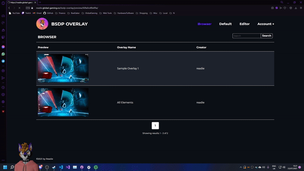

# BSDP-Overlay
## Access the tool [here.](https://readiefur.com/bsdp-overlay/)
**Please Note:** that this tool is still in early acces and it is highly likley that there are many bugs that exist, the tool is not complete yet and there should be much more to come in the future.

## What is this?  
BSDP Overlay is an overlay that can be used with the DataPuller mod for BeatSaber.  
It takes the data outputted by the game and displays it for you, the user to overlay on your recordings/streams. 

## Why is this special?  
There are other overlays out there, so what makes this one special?  
Well aside from the default overlay that has been out since May 25, 2020, this webapp allows you to create your own overlays without needing to know how to code!  

## What's to come:
This webapp is still very new and there should be a lot of changes to come in the future, some things inclue:  
- Block like scripting for events in the game
- Custom CSS
- New elements
- And much more!

## Here are some examples of the webapp in action:  
### Editor:  
  

### View:  
  

### Private/public visibility:  
  

### Game preview:  
  

### Default overlay:  
  

I'm always open to new ideas and sugguestions, so if you feel like something could be added or improved feel free to drop me a message on Github or Discord.

### A note to developers:  
If you would like a web template for obtaining the data from DataPuller, feel free to use the files in [this](./src/assets/js/overlay/) folder.  
In my update for BSDP 2.1 I had patched a bit of the `client.ts` file to make it compatiable with the new `types/` folder, as a result you may want to clean up that file if you wish to use it.  
The `types/` folder contains a set of classes and interfaces that can convert any of the data from BSDP version 2.0 and above into a single format that can be used in your peoject, this will save you from having to bother about getting different bits of data for each specific version of BSDP as I have done that for you. All you need to do is pass the json data into the `Parser` class (found in `types/web`) and depending on the data method you passed to, you will recieve the formatted data for that endpoint.
