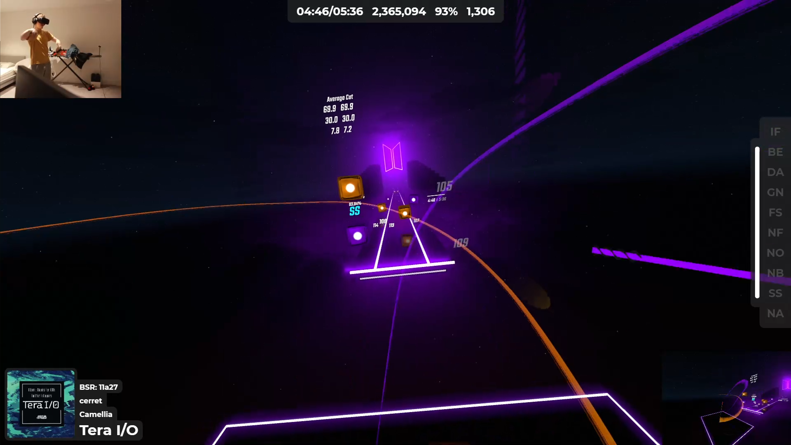
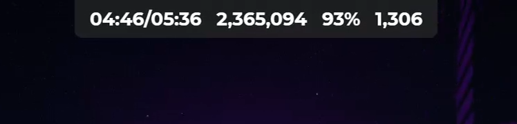
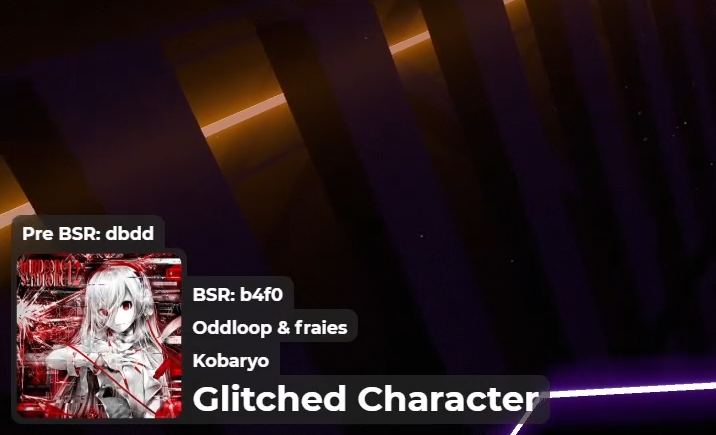
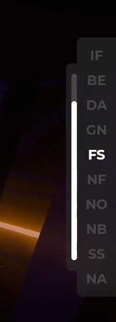
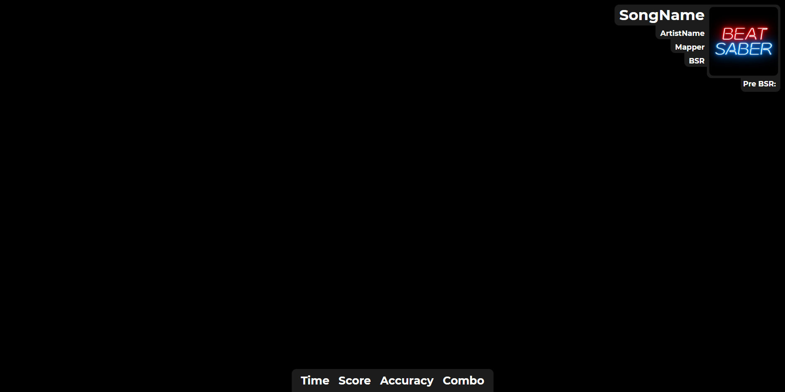

# BSDP-Overlay
A BeatSaber overlay I have created for my [DataPuller](https://github.com/kOFReadie/DataPuller/releases) mod.
This overlay is easy to use, just add the [Overlay](http://u-readie.global-gaming.co/bsdp-overlay/) to your recording/streaming software of choice as a browser source. (Make sure you have the [DataPuller](https://github.com/kOFReadie/DataPuller/releases) mod installed).

## Preview:

## Options:
### IP:
- `ip=*`: Use this parameter if you have the mod setup to send the data over a different IP (Currently for LAN use only)

### UI Scale:
- `scale=*`: changes the scale of the UI, the site was designed for 1080p.

### Element Visibility:
Changes the visibility of the three main elements on the overlay.
- `hideStats`: Hides the map stats.  
  
- `hideMapDetails`: Hides the map details.  
  
- `hideModifiersHealth`: Hides the modifiers and health.  
  

### Element Position:
- `flipHori`: Moves the song information to the right and the modifiers/health to the left.
- `flipVert`: Places the map information at the top.

### Hide when inactive:
- `hideInactive`: Hides the UI when BeatSaber is closed.

### An example of mixed URL parameters:  

## Upcoming changes:
I plan to create an overlay editor, similar to WIX where you can drag and drop elements onto the page, you will be able to customise the fonts and designs etc, at first it may be a little janky but I hope to work on it an improve it a lot over time.